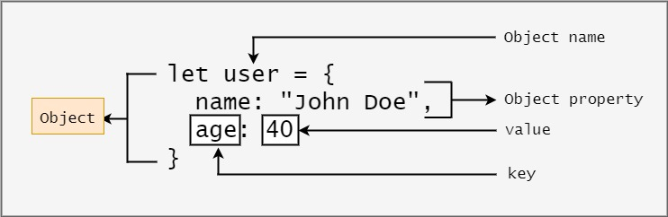

# Object

## Объект ин аз характеристикаву ключу значения иборат аст.Тарзи сохтани ОБъект:

## let obj = { }

## Дар даруни Объект property меояд.

## Ду тарзи гирифтани значения аз Объект:

### 1. console.log(name.property);

### 2. console.log(name ['']);

# Тарзи дар Объект Пропертии нав дабавить кадан:

### name.new name='lorem ipsun';

## Дар вакте ки мо ягон ключи дигара фарёд мекнем.Резуултать underfined мешавад.

## Тарзи удалить кадани роперти ах объект:

### delete name.property

# Методхои Объект:

## 1. Object.keys

### Ин метод мода хамаи ключора дар як массив броварда мета.

## 2. Object.values

### Ин метод мода хамаи значенияхора броварда мета.

## 3. Object.entries

### Инаш бошад мода property- хора массив мекна.

# Destructuring in Object:

## Дар объект мо деспюзатсия ба воси таи фигурний скопка месозем.Бояд номошон совпадать кнан.

# Spread in Object:

## Барои уникалний кадан. Барои ссилкоошона дигар кадан.
